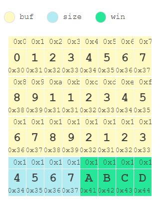

# System hacking

## 해킹이란?

소프트웨어 취약점은 공격자가 주어진 권한 이상의 권한을 획득하거나 프로그래머가 의도하지 않은 동작을 수행할 수 있도록 하는 소프트웨어 버그를 의미.

공격자는 소프트웨어 취약점을 찾아 원하는 것을 달성하려 하고, 보안 전문가들은 취약점을 패치해 프로그램을 보호한다.

하트블리드 취약점은 2014년에 OpenSSL에서 발생했던 취약점으로, 개발자의 잘못된 가정이 얼마나 위험한 결과를 불러올 수 있는지 나타내는 예시다. 이는 OpenSSL의 확장 규격 중 하나인 HeartBeat에서 발생한 취약점으로, 클라이언트에게 전송받은 데이터의 유효성을 검증하지 않아 발생한 정보 탈취 취약점이다.

안정적인 통신 유지를 위해 클라이언트는 HeartBeat 프로토콜을 이용해 임의의 정보를 그 정보의 길이와 함께 서버에 전송하고 서버는 클라이언트에게 전달받은 정보를 그대로 반환해 연결을 확인한다. 그러나 이때 실제 데이터의 길이와 클라이언트가 명시한 데이터의 길이가 서로 다른 경우 문제가 발생한다. 가령 클라이언트가 "theori"라는 데이터와 "6"이라는 데이터 길이를 전송한다면 서버는 정상적으로 "theori"라는 데이터를 반환할 것이다. 만약 클라이언트가 "theori"라는 데이터와 "3000"이라는 데이터 길이를 전송한다면 서버는 문제점을 감지하고 이를 처리해야 한다. 그러나 이 경우 데이터의 길이를 전혀 검증하지 않아 "theori"라는 데이터가 저장된 메모리부터 3,000 바이트를 읽어 클라이언트에게 보내주는 것이다.
공격자는 이를 이용해 시스템 메모리에 저장된 민감한 데이터를 유출할 수 있었고, 해당 취약점은 큰 이슈가 되었다.

## 취약점이란?

익스플로잇이란 사전적으로 악용이란 뜻으로, 취약점을 이용해 공격자가 의도한 동작을 수행하게 하는 코드, 또는 이를 이용한 공격행위를 의미.

소프트웨어 버그는 보안에 영향을 미치는 정도에 따라 크게 4가지로 분류 가능. 

버그/취약점의 분류를 나타내는 다이어그램.
Buggy>Vulnerable>Exploitable>Reliably Exploitable

먼저 프로그래머가 의도하지 않은 동작을 수행하는 소프트웨어 버그(Bug)가 가장 상위에 있다. 그러한 소프트웨어 버그 중 보안에 영향을 미칠 수 있는 버그를 소프트웨어 취약점(Vulnerability)이라 하고, 소프트웨어 취약점 중 이를 이용해 공격자가 의도한 동작을 수행할 수 있는 버그를 익스플로잇 가능한 취약점(Exploitable Vulnerability)이라고 한다. 그러나 익스플로잇이 가능하다고 해서 익스플로잇을 항상 안정적으로 성공할 수 있는 것은 아니다. 보안 취약점에서 익스플로잇 확률은 위험성을 평가하는 중요한 요소 중 하나인데, 이는 익스플로잇 확률이 높을수록 무기화되어 사용하기 유용하고, 공격이 탐지될 확률이 줄어들기 때문이다. 이렇게 익스플로잇이 가능한 취약점 중 매우 높은 확률로 공격에 성공할 수 있는 버그를 안정적으로 익스플로잇 가능한 취약점(Reliably Exploitable Vulnerability)이라고 한다.


## Attack Vector

모든 소프트웨어 취약점은 소프트웨어와 공격자가 상호 작용하는 곳, 즉 사용자의 입력에서부터 발생한다. 이렇게 공격자가 소프트웨어와 상호 작용할 수 있는 곳을 Attack Vector(공격 벡터)라고 하며, 이러한 Attack Vector들의 집합을 Attack Surface라고 한다.

프로그램의 unreachable code 영역에 심각한 보안 취약점이 있다고 가정해 보자. 만약 해당 코드가 어디에서도 사용되지 않고 공격자가 이를 실행할 방법이 없다면 이는 보안 취약점이라고 할 수는 없다. 그러나 이러한 코드도 잠재적으로 악용될 수 있는 코드이기 때문에 존재해서는 안 된다.
따라서 프로그래머는 사용자에게서 입력받는 부분을 철저히 검증해야 함.


## 취약점의 종류- 메모리 커럽션 취약점

취약점은 공격 방법에 따라 크게 두 가지로 나눌 수 있다. 

C/C++과 같은 저수준 언어에서 메모리를 조작해 공격하는 메모리 커럽션 취약점과 메모리를 조작할 필요 없이 공격할 수 있는 로지컬 취약점이다. 

메모리 커럽션 취약점은 다음과 같다.

* **Buffer Overflow**
Buffer Overflow(BOF)는 메모리 커럽션 취약점 중 가장 대표적인 취약점이다. 이는 프로그래머가 할당한 크기의 버퍼보다 더 큰 데이터를 입력받아 메모리의 다른 영역을 오염시킬 수 있는 취약점이다. 버퍼 오버플로우는 발표된 지 30년에 가까운 시간이 흘렀지만, 아직도 공격에 자주 사용되는 취약점이다.

* **Out-Of-Boundary**
Out-Of-Boundary(OOB) 취약점은 버퍼의 길이 범위를 벗어나는 곳의 데이터에 접근할 수 있는 취약점이다. 이 또한 버퍼 오버플로우와 마찬가지로 매우 강력한 취약점으로, 브라우저와 같은 대규모 최신 소프트웨어에서도 자주 발견되는 취약점이다.

* **Off-by-one**
Off-by-one은 경계 검사에서 하나 더 많은 값을 쓸 수 있을 때 발생하는 취약점이다. 가령 32바이트 크기의 버퍼에 인덱스 32로 접근하는 것 같은 경우다. 이는 반복문을 순회할 때 잘못된 비교 연산자를 사용하거나 인덱스가 0부터 시작하는 것을 고려하지 못했을 때 자주 발생하는 취약점이다.

* **Format String Bug**
Format String Bug(FSB)는 printf나 sprintf와 같은 함수에서 포맷 스트링 문자열을 올바르게 사용하지 못해 발생하는 취약점. 포맷 스트링 역시 매우 강력한 취약점이지만, 최신 컴파일러에서는 여러 가지 방법으로 이를 방어하고 있어 최근에는 잘 발생하지 않고 있다.

* **Double Free / Use-After-Free**
Double Free와 Use-After-Free(UAF) 취약점은 동적 할당된 메모리를 정확히 관리하지 못했을 때 발생하는 취약점. 이미 해제된 메모리를 다시 한번 해제하려고 시도하는 것을 Double Free, 해제된 메모리에 접근해 이를 사용하려고 하는 것을 Use-After-Free라고 한다.

## 취약점 종류- 로지컬 버그

로지컬 버그는 메모리 커럽션 취약점과는 달리 프로그램의 메모리 구조를 이용해 공격할 필요가 없습니다. 따라서 익스플로잇 작성이 메모리 커럽션 취약점보다는 상대적으로 간단합니다.

* **Command Injection**
Command Injection은 사용자의 입력을 셸에 전달해 실행할 때 정확한 검사를 실행하지 않아 발생하는 취약점입니다. 이는 공격자가 원하는 명령을 실행할 수 있는 데 비해 익스플로잇이 어렵지 않아 매우 강력한 취약점입니다.

* **Race Condition**
보안 취약점으로서의 Race Condition은 여러 스레드나 프로세스의 자원 관리를 정확히 수행하지 못해 데이터가 오염되는 취약점입니다. 레이스 컨디션은 발생 원인과 공격 방법에 따라 메모리 커럽션 취약점으로도, 로지컬 취약점으로도 분류할 수 있는 취약점입니다.

* **Path Traversal**
Path Traversal은 프로그래머가 가정한 디렉토리를 벗어나 외부에 존재하는 파일에 접근할 수 있는 취약점입니다. 이는 주로 소스 코드에서 "../"와 같은 경로 문자를 검사하지 않아 발생합니다.

## 보호기법

컴퓨터 과학자들은 기본적으로 취약점은 존재한다는 전제하에 시스템을 보호하는 방법을 고민했고, 그래서 등장한게 보호기법(Mitigation).

보호기법은 취약점을 통한 공격을 어렵게 만든다. 예를 들어, 스택 버퍼 오버플로우에 대한 보호기법 중 하나인 Stack Smashing Protector(SSP)는 버퍼의 뒤에 랜덤한 값을 넣어두고, 이 값을 특정 시점에 검사하여 버퍼 오버플로우가 발생했는지 탐지합니다. 그리고 만약 공격이 발생했다면 프로그램을 강제로 종료시킵니다. 이로 인해 공격자는 프로그램에서 버퍼 오버플로우 취약점을 발견해도 공격에 이용하기가 어려워졌다.

그러나 해커들 역시 보호기법을 우회하기 위해 여러 새로운 공격기법들을 고안하였다. 이렇게 새로 등장한 공격기법을 막기 위해 또 새로운 보호기법이 생기고, 이를 우회하기 위한 또 다른 공격기법들이 만들어지게 된다. 공격기법과 보호기법의 공방은 처음 스택 버퍼 오버플로우를 공격하는 문서가 발표된 이후 지금까지 꾸준히 계속되고 있다.


# 1. 버퍼 오버플로우

가장 먼저 살펴볼 취약점은 버퍼 오버플로우 취약점이다.
C언어에서 버퍼란 지정된 크기의 메모리 공간이다.
버퍼 오버플로우 취약점은 그 이름에서 나타나듯이 버퍼가 허용할 수 있는 양의 데이터보다 더 많은 값이 저장돼 버퍼가 넘치는 취약점이다.

일반적으로 버퍼 오버플로우는 발생하는 위치에 따라 스택 버퍼 오버플로우, 힙 오버플로우와 같이 나눠서 부른다. 

버퍼 오버플로우는 인접한 메모리를 오염시키는 취약점이기 때문에 어떤 메모리를 오염시킬 수 있는지에 따라 공격 방법이 달라진다.
그중 스택 버퍼 오버플로우는 가장 초기에 연구됐던 형태의 버퍼 오버플로우로, 지역 변수가 할당되는 스택 메모리에서 오버플로우가 발생하는 경우다.

먼저 8바이트의 버퍼 A와 8바이트 데이터 버퍼 B가 메모리에 선형적으로 할당되었다고 생각해 보자. 여기서 버퍼 A에 16 바이트의 데이터를 복사한다면 이 데이터의 뒷부분은 버퍼 A를 넘어 뒤에 있는 데이터 영역인 B에 쓰여지게 된다.

이때 우리는 버퍼 오버플로우가 발생했다고 하고, 이는 프로그램의 Undefined Behavior을 이끌어낸다. 만약 데이터 영역 B에 나중에 호출될 함수 포인터를 저장하고 있다면 이 값을 "AAAAAAAA"와 같은 데이터로 덮었을 때 Segmantation Fault를 발생시킬 것이다. 만약 공격자가 이를 악용한다면 어딘가에 기계어 코드를 삽입한 후 함수 포인터를 공격자의 코드의 주소로 덮어 코드를 실행할 수도 있다.

## 스택 버퍼 오버플로우

```
// stack-1.c
#include <stdio.h>
#include <stdlib.h>
int main(void) {
    char buf[16];
    gets(buf);
    
    printf("%s", buf);
}
```


stack-1.c는 16 바이트 버퍼 buf를 스택에 할당한 후, gets 함수를 통해 사용자로부터 데이터를 입력받아 이를 그대로 출력하는 코드다. gets함수는 사용자가 개행을 입력하기 전까지 입력했던 모든 내용을 첫 번째 인자로 전달된 버퍼에 저장하는 함수다. 그러나 gets 함수에는 별도의 길이 제한이 없기 때문에 16 바이트가 넘는 데이터를 입력한다면 스택 버퍼 오버플로우가 발생한다.

이처럼 버퍼 오버플로우 취약점은 프로그래머가 버퍼의 길이에 대한 가정을 올바르지 않게 하여 발생한다. 이는 보통 길이 제한이 없는 API 함수들을 사용하거나 버퍼의 크기보다 입력받는 데이터의 길이가 더 크게 될 때 자주 일어나는 실수다.


```
// stack-2.c
#include <stdio.h>
#include <stdlib.h>
#include <string.h>
int check_auth(char *password) {
    int auth = 0;
    char temp[16];
    
    strncpy(temp, password, strlen(password));
    
    if(!strcmp(temp, "SECRET_PASSWORD"))
        auth = 1;
    
    return auth;
}
int main(int argc, char *argv[]) {
    if (argc != 2) {
        printf("Usage: ./stack-1 ADMIN_PASSWORD\n");
        exit(-1);
    }
    
    if (check_auth(argv[1]))
        printf("Hello Admin!\n");
    else
        printf("Access Denied!\n");
}
```
stack-2.c의 main 함수는 argv[1]을 check 함수의 인자로 전달한 후 그 리턴 값을 받아옵니다. 리턴 값이 0이 아니라면 "Hello Admin!"을, 0이라면 "Access Denied!"라는 문자열을 출력한다.

핵심이 되는 check 함수에서는 16 바이트 크기의 temp 버퍼에 입력받은 패스워드를 복사한 후 "SECRET_PASSWORD" 문자열과 비교한다. 문자열이 같다면auth 변수를 1로 설정하고 auth를 리턴한다.

그러나 line 10에서 strncpy 함수를 통해 temp 버퍼를 복사할 때, temp의 크기인 16 바이트가 아닌 인자로 전달된 password 문자열의 길이만큼을 복사한다. 따라서 argv[1]에 16 바이트가 넘는 문자열을 전달한다면 길이 제한 없이 문자열이 복사되어 스택 버퍼 오버플로우가 발생하게 된다.

temp 버퍼 뒤에 auth 값이 존재하므로, 오버플로우가 발생해 공격자의 데이터가 auth 값을 바꾼다면 auth가 0이 아닌 다른 값이 될 수 있다. 이 경우 실제 인증 여부와는 상관없이 line 24의 if(check_auth(argv[1])) 문은 항상 참을 반환하게 된다.

```
// stack-3.c
#include <stdio.h>
#include <unistd.h>
int main(void) {
    char win[4];
    int size;
    char buf[24];
    
    scanf("%d", &size);
    read(0, buf, size);
    if (!strncmp(win, "ABCD", 4)){
        printf("Theori{-----------redacted---------}");
    }
}
```

stack-3.c의 main함수는 24 바이트 크기의 버퍼 buf를 할당한다. scanf 함수를 통해 size 변수에 값을 입력받고, size만큼 buf에 데이터를 입력받는다.





`
// stack-4.c
#include <stdio.h>
int main(void) {
	char buf[32] = {0, };
	read(0, buf, 31);
	sprintf(buf, "Your Input is: %s\n", buf);
	puts(buf);
}
`
stack-4.c는 32바이트 크기 buf를 초기화한 후 데이터를 31바이트 입력받고, sprintf 함수를 통해 출력할 문자열을 저장한 뒤 출력하는 코드다.

read 함수에서 받는 입력이 32바이트를 넘진 않지만, sprintf 함수를 통해 버퍼에 값을 쓸 때 "Your Input is: "문자열을 추가한다는 사실을 생각해야 한다. 만약 buf에 31바이트를 꽉 채운다면 "Your Input is: " 문자열이 앞에 붙어 총 길이가 32바이트를 넘게 된다.


지금까지 살펴본 바와 같이 버퍼 오버플로우는 프로그래머가 길이에 대한 검증을 정확히 수행하지 못해 발생한다. 만약 공격 벡터로부터 데이터를 입력받고 이를 버퍼에 저장하는 코드가 있다면 이를 유심히 살펴볼 필요가 있다. 데이터를 버퍼에 입력받을 때는 입력받은 데이터가 버퍼의 범위를 초과하지 않는지 항상 정확히 검사해야 한다.

입력받을 때 길이 제한이 없는 함수를 사용한다면 이는 잠재적으로 취약하다고 볼 수 있다. 입력받은 데이터가 버퍼에 저장되기까지의 흐름을 따라가 버퍼의 크기를 넘는 양을 저장할 수 있는지 가능성을 검토해야 한다. 만약 길이를 명시하는 함수를 사용한다면, 명시된 길이가 버퍼의 크기를 넘을 수 있는지를 검토해야 한다.

버퍼 오버플로우는 스택에서만 발생하는 취약점이 아니다. 프로그래머가 동적으로 메모리를 관리할 수 있는 힙에서도 똑같이 발생할 수 있다. 이들은 단지 발생하는 메모리 영역의 차이만 있을 뿐이고 취약점이 발생하는 원인이 본질적으로 다르진 않다.

힙 영역은 스택 영역과 사용 목적이 다르기 때문에, 스택 버퍼 오버플로우와는 다른 방법으로 익스플로잇해야 한다. 힙 오버플로우를 익스플로잇하는 방법은 Linux Exploitation & Mitigation 강의에서 다룬다. 여기서는 힙 오버플로우가 어떻게 발생하는지에 대해서만 간단히 알아보도록 하겠다.


## 힙 오버플로우

```
// heap-1.c
#include <stdio.h>
#include <stdlib.h>
int main(void) {
    char *input = malloc(40);
    char *hello = malloc(40);
    
    memset(input, 0, 40);
    memset(hello, 0, 40);
    
    strcpy(hello, "HI!");
    read(0, input, 100);
    
    printf("Input: %s\n", input);
    printf("hello: %s\n", hello);
}
```

heap-1.c는 40바이트 크기의 힙 버퍼 input과 hello를 할당한 후, hello 버퍼에는 "HI!" 문자열을 복사하고 read 함수를 통해 input에 데이터를 입력받는 코드이다. 그러나 read 함수를 통해 입력받는 길이인 100바이트가 input 버퍼의 크기인 40바이트보다 크기 때문에 힙 오버플로우가 발생한다.


힙 오버플로우가 발생했을 때의 힙 메모리 상태는 아래의 그림으로 간략히 나타낼 수 있다.


input 영역에서 버퍼 오버플로우가 발생해 hello의 메모리 영역까지 침범할 경우, line 16에서 hello 메모리를 출력할 때 "HI!" 문자열이 아니라 공격자에게 오염된 데이터가 출력된다.


# 2. Out-of-boundary (OOB)

```
// oob-1.c
#include <stdio.h>
int main(void) {
    int win;
    int idx;
    int buf[10];
    
    printf("Which index? ");
    scanf("%d", &idx);
    printf("Value: ");
    scanf("%d", &buf[idx]);
    printf("idx: %d, value: %d\n", idx, buf[idx]);
    if(win == 31337){
        printf("Theori{-----------redacted---------}");
    }
}
```
OOB(Out Of Boundary)는 버퍼의 길이 범위를 벗어나는 인덱스에 접근할 때 발생하는 취약점이다.

oob1.c에서는 int형 배열 buf를 선언하고 idx 값을 입력 받는다. 그다음 buf[idx]에 정수를 입력받고 idx와 buf[idx] 값을 출력한다.

여기서 주의해야 할 점은 buf의 길이는 10이므로 buf의 인덱스로 사용될 수 있는 올바른 값은 0 이상 10 미만의 정수라는 사실이다. 그러나 코드에서는 line 10에서 입력받은 idx 값을 인덱스로 사용할 때 해당 값이 올바른 범위에 속해 있는지 검사하지 않는다. C언어는 인덱스를 이용해 버퍼에 접근할 때 인덱스의 범위에 대한 별도의 경계 검사가 존재하지 않기 때문에 올바르지 않은 값을 사용한다면 buf의 영역 밖에 있는 값에 접근할 수 있다.

그렇다면 idx와 buf[idx]에 적당한 값을 줘서 win 변수를 31337로 만들어보자.


```
// oob-2.c
#include <stdio.h>
int main(void) {
    int idx;
    int buf[10];
    int win;
    
    printf("Which index? ");
    scanf("%d", &idx);
    
    idx = idx % 10;
    printf("Value: ");
    scanf("%d", &buf[idx]);
    printf("idx: %d, value: %d\n", idx, buf[idx]);
    if(win == 31337){
        printf("Theori{-----------redacted---------}");
    }
}
```

oob-2.c는 oob-1.c와는 달리 line 12에 idx = idx % 10이라는 코드가 추가되었다. 이 코드로 OOB 취약점을 막을 수 있을까?

OOB의 발생 여부를 판단할 때는 버퍼의 인덱스로 사용할 수 있는 올바른 값의 범위와 버퍼의 인덱스가 될 수 있는 모든 값의 범위를 비교하면 된다. 인덱스가 될 수 있는 값의 범위가 사용할 수 있는 올바른 값의 범위의 부분집합이라면 안전하다고 할 수 있을 것이다. 그렇다면 oob2.c에 이를 적용해 보겠다.

* buf의 인덱스로 써야 하는 값의 범위: 0~9

* buf의 인덱스로 쓸 수 있는 값의 범위: int 형의 범위 % 10

양의 정수를 10으로 나눈 나머지로 가능한 값은 0에서 9까지기 때문에 이는 얼핏 보면 안전해 보입니다. 그러나 C언어에서는 피연산자가 음수라면 나머지 연산의 결과도 음수가 될 수 있다. 따라서 이 경우, buf의 인덱스로 쓸 수 있는 값의 범위는 -9 ~ 9이므로 나머지가 음수가 되게 한다면 OOB를 발생시킬 수 있다.


```
//oob-3.c
#include <stdio.h>
int main(void) {
    int idx;
    int buf[10];
    int dummy[7];
    int win;
    printf("Which index? ");
    scanf("%d", &idx);
    
    if(idx < 0)
        idx = -idx;
    idx = idx % 10; // No more OOB!@!#!
    printf("Value: ");
    scanf("%d", &buf[idx]);
    printf("idx: %d, value: %d\n", idx, buf[idx]);
    if(win == 31337){
        printf("Theori{-----------redacted---------}");
    }
}
```

oob-3.c는 oob-2.c와는 다르게 idx가 음수일 경우 이를 양수로 바꿔주는 코드가 추가되었다. line 14에 들어가게 되는 idx 값은 양수가 되고, 10으로 나머지 연산을 했을 때 값의 범위는 0부터 9까지기 때문에 아무 문제가 없어 보인다.

그러나 C언어의 정수 표현에 대해 생각해보면, 뭔가 이상한 부분이 있다는 걸 알 수 있다. 몇 가지 idx 값에 따라 line 14가 어떻게 실행되는지 자세히 살펴보겠다.

* idx = 1 (line 14) -> idx = 1 (line 15)

* idx = -100 (line 14) -> idx = 100 (line 15)

* idx = -10000 (line 14) -> idx = 10000 (line 15)

* idx = -pow(2, 31) (line 14) -> idx = -pow(2, 31) (line 15)

마지막으로 나타나 있는 예제가 직관적으로 이해되지 않을 수 있다. 


C언어에서 int형으로 표현 가능한 정수의 범위는 -pow(2, 31) ~ pow(2, 31) - 1 이다. int형은 32비트이기 때문에 총 pow(2, 32)개의 수를 표현할 수 있다. int형은 0을 포함하기 때문에 표현할 수 있는 음의 정수의 갯수와 양의 정수의 갯수는 다르다.

int 형에서 -pow(2,31)은 표현 가능하지만 pow(2,31)은 표현 가능하지 않다. pow(2,31)은 표현 가능한 최대 정수보다 하나 더 크기 때문에 이는 -pow(2,31)과 같은 값이 된다.

oob-3.c를 다시 살펴보겠다. 지금까지 논의한 바에 따르면, idx에 -pow(2, 31)을 넣었을 경우 line 14에서 절대값을 구하는 연산을 수행한 후에도 -2^31이 그대로 저장된다. 그렇다면 line 15에서 idx = idx % 10을 할 때 idx에 음수가 저장되고, 이는 buf 배열의 올바른 인덱스 범위를 벗어나기 때문에 OOB가 발생한다.

이를 근본적으로 막기 위해서는 idx를 int형이 아닌 unsigned int형으로 선언하거나, 인덱스를 입력받은 이후에 if(idx < 0 || idx >= 10)과 같은 경계 검사 구문을 추가해야 한다.


# 3. Off-by-one

```
#include <stdio.h>
void copy_buf(char *buf, int sz) {
    char temp[16];
    
    for(i = 0; i <= sz; i++)
        temp[i] = buf[i];
}
int main(void) {
    char buf[16];
    
    read(0, buf, 16);
    copy_buf(buf, sizeof(buf));
}
```

Off-by-one 취약점은 경계 검사에서 하나의 오차가 있을 때 발생하는 취약점이다. 이는 버퍼의 경계 계산 혹은 반복문의 횟수 계산 시 < 대신 <=을 쓰거나, 0부터 시작하는 인덱스를 고려하지 못할 때 발생한다.

off-by-one-1.c는 buf에 16바이트 문자열을 입력받은 후 buf와 sizeof(buf)의 값을 copy_buf 함수의 인자로 전달한다. copy_buf함수에서는 임시 버퍼 temp를 할당하고 반복문을 통해 buf의 데이터를 복사한다. 그러나 반복문은 i가 0일 때부터 sz일 때까지 총 sz + 1번 반복하게 된다. 따라서 sz + 1만큼 데이터가 복사되고, off-by-one 취약점이 발생한다.


1. 스택 버퍼 오버플로우
스택 버퍼 오버플로우는 가장 초기에 등장한 버퍼 오버플로우 형태 중 하나로, 지역 변수가 할당되는 스택 메모리에서 발생하는 취약점이다. 이는 데이터를 입력받거나 복사하는 부분에 대한 길이 검증이 존재하지 않거나 미흡할 경우에 발생한다.

2. 힙 오버플로우
힙 버퍼 오버플로우는 동적으로 할당된 힙 메모리 영역에서 발생하는 취약점이다. 이는 데이터를 입력받거나 복사하는 부분에 대한 길이 검증이 존재하지 않거나 미흡할 경우에 발생한다.


3. Out-Of-Boundary
Out-Of-Boundary는 버퍼의 길이 범위를 벗어나는 인덱스에 접근할 때 발생하는 취약점이다. 이는 올바르지 않은 값이 버퍼의 인덱스로 사용될 경우 발생한다.

4. Off-by-one
Off-by-one은 버퍼의 경계 계산 혹은 잘못된 반복문의 연산자를 사용하는 등의 인덱스를 고려하지 않을 때 발생하는 취약점이다.


# 1. Format String Bug

포맷 스트링 버그는 printf나 sprintf와 같이 포맷 스트링을 사용하는 함수에서 발생하는 취약점으로, "%x"나 "%s"와 같이 프로그래머가 지정한 문자열이 아닌 사용자의 입력이 포맷 스트링으로 전달될 때 발생하는 취약점입니다.
```
// fsb-1.c
#include <stdio.h>
int main(void) {
    char buf[100] = {0, };
    
    read(0, buf, 100);
    printf(buf);
}

```


printf(buf);와 같이 사용자의 입력이 printf 함수의 인자로 그대로 전달될 때를 생각해 보겠다. "asdf"와 같은 일반적인 문자열이 전달된다면 입력한 문자열이 그대로 출력될 것이다. 그러나 "%x"와 "%s"와 같은 포맷 스트링이 들어간다면 이는 인자를 전달하지 않고 포맷 스트링을 전달한 것과 같은 효과가 된다. 포맷 스트링 버그는 이처럼 검증되지 않은 사용자의 입력이 포맷 스트링으로 취급되어 프로그래머가 의도하지 않은 동작을 수행하는 버그이다.

fsb-1.c는 char형 배열 buf에 100 바이트를 입력받고 printf 함수를 통해 입력받은 버퍼를 출력하는 간단한 예제이다.

만약 "asdf"나 "10"과 같은 일반적인 문자열을 입력한다면 printf 문은 printf("asdf"); 혹은 printf("10"); 과 같이 된다. 이 경우에는 정상적으로 문자열이 출력된다.

그러나 "%x %d"와 같은 포맷 스트링을 문자열로 입력한다면, printf(buf)는 printf("%x %d")가 된다. printf("%x %d")에는 두 번째 인자와 세 번째 인자가 전달되지 않기 때문에 쓰레기 값을 인자로 취급해 출력한다.


